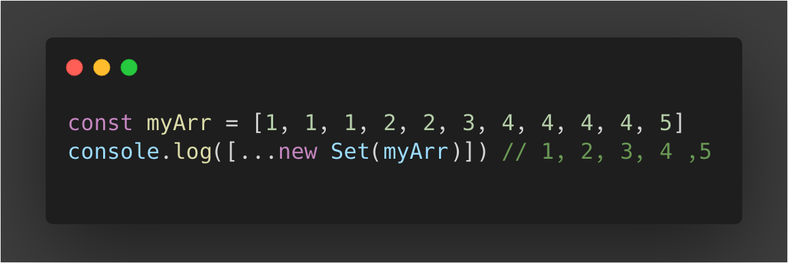

Took a while, but we're here! I was more focused on the Front End of my portfolio that I completely left out publishing blogs of everyday things that happened while developing the infrastructure of my portfolio.

Some of those include learning and implementing GraphQL while using Gatsby.js, creating and rendering both Markdown files and HTML files while using Gatsby Node, and using cookies to make sure animations don't overlap while on this site.

First up, I would like to provide some Javascript tools I've been using lately that has helped me code neat, efficient code.

  <h1>Shorthand - using Sets with&nbsp;<a href="https://developer.mozilla.org/en-US/docs/Web/JavaScript/Reference/Global_Objects/Set" target="_blank">ES6</a>
  </h1>

  <h1>In a function object</h1>

  

    -Cesar C.
  

