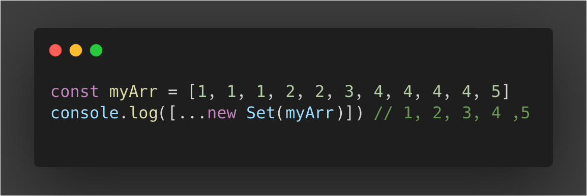
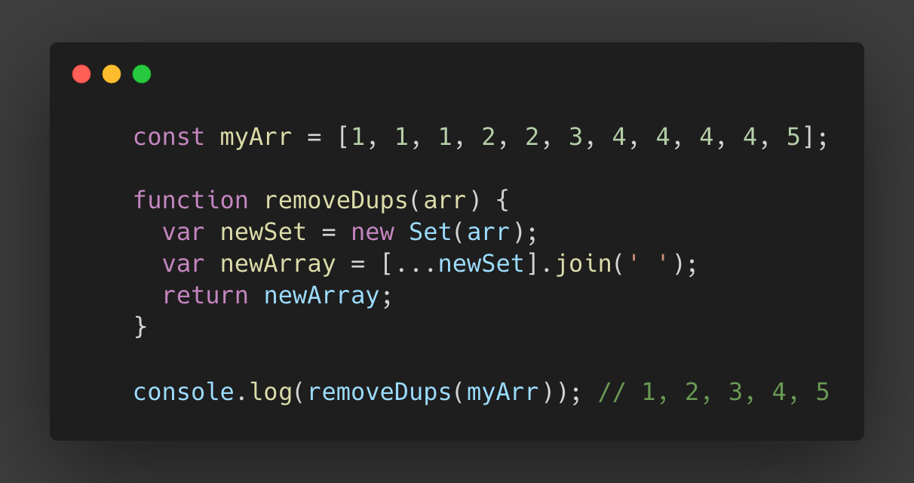

Quarantine has got the best out of everyone! During this time i've had a lot of down time and have created simple projects with a responsive UI. While they are working with Vanilla JS (which to me is the most important), it will help in my development when using Javascript framework or library.

  <h1>Shorthand - using Sets with&nbsp;<a href="https://developer.mozilla.org/en-US/docs/Web/JavaScript/Reference/Global_Objects/Set" target="_blank">ES6</a>
  </h1>

  <h1>In a function object</h1>

  

    -Cesar C.
  

